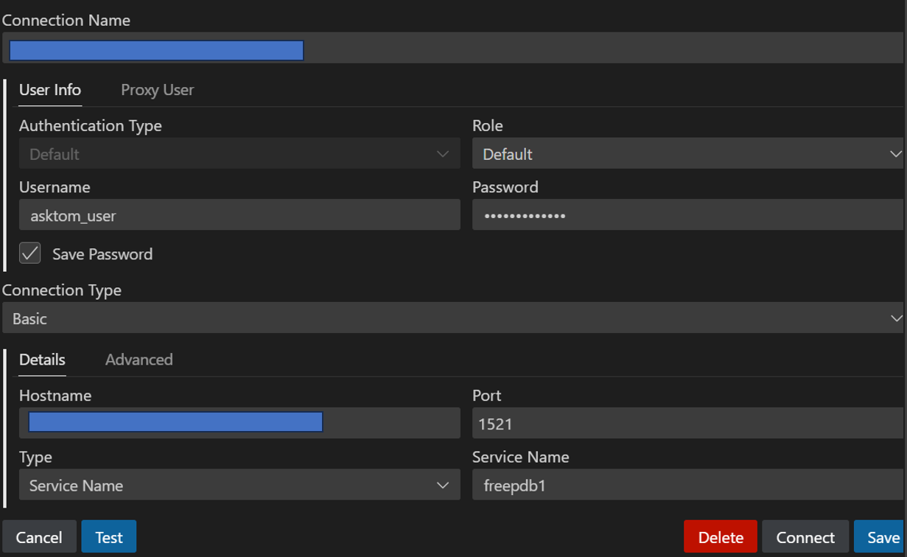

# Enable and configure client access to your database

To connect to the Oracle Database running in a container on your OCI compute VM, you need to configure two more things:

1. Permit incoming TCP traffic via port 1521
2. Adapt the firewall of the compute VM

## Steps

1. Add port 1521 to the security list of the OCI VCN subnet used by the compute VM.

   See the following image for details.

      

      You can also refer to the documentation for [Updating Rules in a Security List](https://docs.oracle.com/en-us/iaas/Content/Network/Concepts/update-securitylist.htm).

2. Allow TCP transport via the firewall of the compute VM

   Login as root user to the compute instance.

   ```sh
   firewall-cmd --permanent --zone=public --add-port=1521/tcp
   firewall-cmd --reload
   exit
   ```

3. Configure your database client

   You can now configure your clients to connect to the database. The following two images display how you set up the DB connection in:

      * Visual Studio using the SQL Developer extension

         

      * SQL Developer

         

Proceed now with [Getting started with ORacle GeoRaster](./04-get-started_with_georaster.md).
