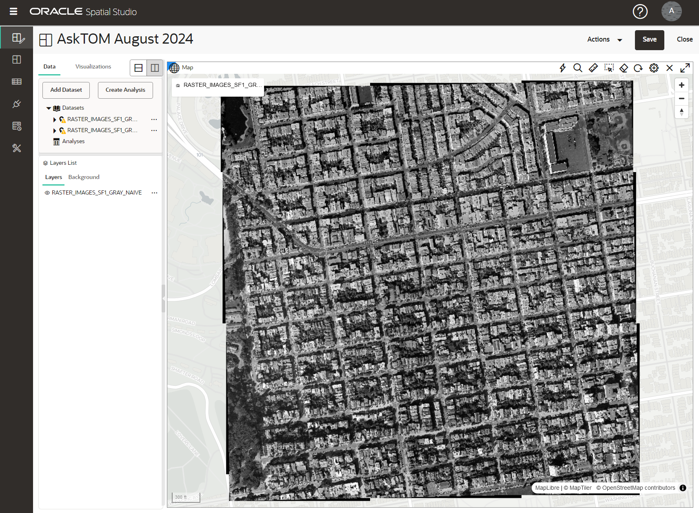
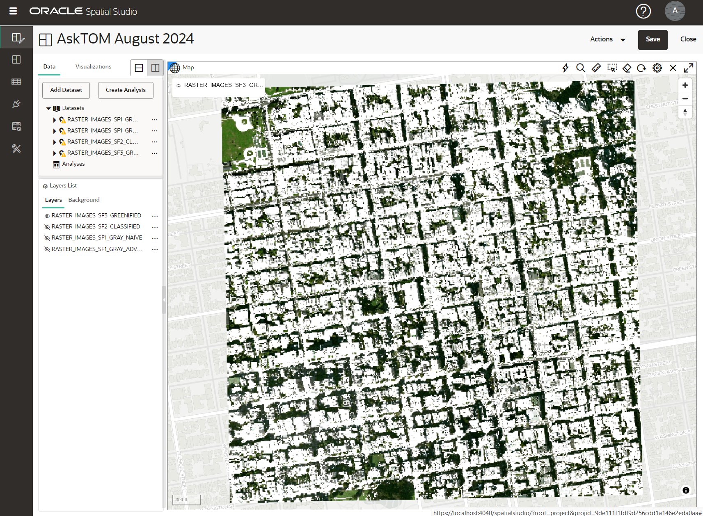

# Get started with GeoRaster

## Prerequisites

1. Start the database container

   This step is only required if the container is not running.

   ```sh
   # Check if the container is running
   podman container ls

   # If not, start it
   podman start 23aifree

   # and check the result
   podman container ls
   ```

2. Connect to the database

   You can use Podman to connect to the database inside the container.

   ```sh
   podman exec -it 23aifree sqlplus asktom_user/${ORACLE_PWD}@localhost:1521/freepdb1
   ```

   Or, use the Oracle Database client of your choice, such as `SQL Developer` or `Visual Studio` with the `SQL Developer extension`.

## Set up database tables to store raster data

1. Create tables

   ```sql
   -- Clean up
   drop table if exists raster_images_rdt_01 purge;
   drop table if exists raster_images purge;

   -- Create table to store raster image data
   create table if not exists raster_images (
      georid              number primary key,
      source_file         varchar2(80),
      description         varchar2(256),
      georaster           sdo_georaster
   );

   create table if not exists raster_images_rdt_01 of sdo_raster (
      primary key (
         rasterid, pyramidlevel, bandblocknumber,
         rowblocknumber, columnblocknumber
      )
   )
   lob(rasterblock) store as securefile (
      nocache nologging
   );

   select table_name from user_tables order by 1;

   -- Logout
   quit
   ```

## Load raster data into the database

1. Define your Database connection as environment variable

   ```sh
   export DB_CONNECTION=asktom_user/${ORACLE_PWD}@localhost:1521/freepdb1
   echo $DB_CONNECTION
   ```

2. This .zip archive contains sample raster files in different formats. We want to load the georefenced .tif files as examples into the database. To do that, you first need to download and extract the data on your compute VM. Then use `GDAL` for the next steps.

   ```sh
   # Connect as user `opc`

   mkdir -p ~/data
   cd ~/data

   # Fetch the .zip archive with the sample raster files
   wget ...

   # Unzip the archive
   unzip ...

   # Show the folder structure and its contents
   tree
   ```

3. Check the sample data

   ```sh
   # Get details about the sample data
   gdalinfo ./tiff/sf1.tif
   ```

   You will see textual information like the following:

   ```txt
   Driver: GTiff/GeoTIFF
   Files: ./tiff/sf1.tif
         ./tiff/sf1.tif.aux.xml
   Size is 4299, 4299
   Coordinate System is:
   PROJCRS["NAD83 / California zone 3",
      BASEGEOGCRS["NAD83",
         DATUM["North American Datum 1983",
               ELLIPSOID["GRS 1980",6378137,298.257222101,
                  LENGTHUNIT["metre",1]]],
         PRIMEM["Greenwich",0,
               ANGLEUNIT["degree",0.0174532925199433]],
         ID["EPSG",4269]],
      CONVERSION["SPCS83 California zone 3 (meters)",
         METHOD["Lambert Conic Conformal (2SP)",
               ID["EPSG",9802]],
         PARAMETER["Latitude of false origin",36.5,
               ANGLEUNIT["degree",0.0174532925199433],
               ID["EPSG",8821]],
         PARAMETER["Longitude of false origin",-120.5,
               ANGLEUNIT["degree",0.0174532925199433],
               ID["EPSG",8822]],
         PARAMETER["Latitude of 1st standard parallel",38.4333333333333,
               ANGLEUNIT["degree",0.0174532925199433],
               ID["EPSG",8823]],
         PARAMETER["Latitude of 2nd standard parallel",37.0666666666667,
               ANGLEUNIT["degree",0.0174532925199433],
               ID["EPSG",8824]],
         PARAMETER["Easting at false origin",2000000,
               LENGTHUNIT["metre",1],
               ID["EPSG",8826]],
         PARAMETER["Northing at false origin",500000,
               LENGTHUNIT["metre",1],
               ID["EPSG",8827]]],
      CS[Cartesian,2],
         AXIS["easting (X)",east,
               ORDER[1],
               LENGTHUNIT["metre",1]],
         AXIS["northing (Y)",north,
               ORDER[2],
               LENGTHUNIT["metre",1]],
      USAGE[
         SCOPE["Engineering survey, topographic mapping."],
         AREA["United States (USA) - California - counties Alameda; Calaveras; Contra Costa; Madera; Marin; Mariposa; Merced; Mono; San Francisco; San Joaquin; San Mateo; Santa Clara; Santa Cruz; Stanislaus; Tuolumne."],
         BBOX[36.73,-123.02,38.71,-117.83]],
      ID["EPSG",26943]]
   Data axis to CRS axis mapping: 1,2
   Origin = (1828467.919737499905750,646446.278891499969177)
   Pixel Size = (0.304800999999999,-0.304800999999999)
   Metadata:
   AREA_OR_POINT=Area
   Image Structure Metadata:
   INTERLEAVE=PIXEL
   Corner Coordinates:
   Upper Left  ( 1828467.920,  646446.279) (122d26'52.94"W, 37d48'12.51"N)
   Lower Left  ( 1828467.920,  645135.939) (122d26'51.82"W, 37d47'30.01"N)
   Upper Right ( 1829778.259,  646446.279) (122d25'59.38"W, 37d48'13.39"N)
   Lower Right ( 1829778.259,  645135.939) (122d25'58.27"W, 37d47'30.89"N)
   Center      ( 1829123.089,  645791.109) (122d26'25.60"W, 37d47'51.70"N)
   Band 1 Block=4299x1 Type=Byte, ColorInterp=Red
   Min=0.000 Max=255.000
   Minimum=0.000, Maximum=255.000, Mean=108.878, StdDev=72.983
   Metadata:
      STATISTICS_APPROXIMATE=YES
      STATISTICS_MAXIMUM=255
      STATISTICS_MEAN=108.87750014755
      STATISTICS_MINIMUM=0
      STATISTICS_STDDEV=72.982957647651
      STATISTICS_VALID_PERCENT=100
   Band 2 Block=4299x1 Type=Byte, ColorInterp=Green
   Min=0.000 Max=255.000
   Minimum=0.000, Maximum=255.000, Mean=109.748, StdDev=63.239
   Metadata:
      STATISTICS_APPROXIMATE=YES
      STATISTICS_MAXIMUM=255
      STATISTICS_MEAN=109.74848020886
      STATISTICS_MINIMUM=0
      STATISTICS_STDDEV=63.239142215742
      STATISTICS_VALID_PERCENT=100
   Band 3 Block=4299x1 Type=Byte, ColorInterp=Blue
   Min=0.000 Max=255.000
   Minimum=0.000, Maximum=255.000, Mean=91.301, StdDev=66.681
   Metadata:
      STATISTICS_APPROXIMATE=YES
      STATISTICS_MAXIMUM=255
      STATISTICS_MEAN=91.301097443696
      STATISTICS_MINIMUM=0
      STATISTICS_STDDEV=66.681441522669
      STATISTICS_VALID_PERCENT=100
   ```

   Note, that `GDAL` will automatically convert images whose color space is `YCbCr`, `CMYK` or `YCbCrK` to `RGB` when loaded.

4. Load the sample data

   ```sh
   # Load all georeferenced .tif files. Make sure the RASTER_IMAGES tables is empty.

   # SF1
   gdal_translate -of georaster ./tiff/sf1.tif georaster:$DB_CONNECTION,raster_images,georaster \
      -co insert="(GEORID, SOURCE_FILE, GEORASTER) values (1, 'sf1.tif', sdo_geor.init('raster_images_rdt_01'))" \
      -co blockxsize=512 -co blockysize=512 -co blockbsize=3 -co interleave=bip \
      -co spatialextent=true -co blocking=optimalpadding -co genpyramid=nn

   # SF2
   gdal_translate -of georaster ./tiff/sf2.tif georaster:$DB_CONNECTION,raster_images,georaster \
      -co insert="(GEORID, SOURCE_FILE, GEORASTER) values (2, 'sf2.tif', sdo_geor.init('raster_images_rdt_01'))" \
      -co blockxsize=512 -co blockysize=512 -co blockbsize=3 -co interleave=bip \
      -co spatialextent=true -co blocking=optimalpadding -co genpyramid=nn

   # SF3
   gdal_translate -of georaster ./tiff/sf3.tif georaster:$DB_CONNECTION,raster_images,georaster \
      -co insert="(GEORID, SOURCE_FILE, GEORASTER) values (3, 'sf3.tif', sdo_geor.init('raster_images_rdt_01'))" \
      -co blockxsize=512 -co blockysize=512 -co blockbsize=3 -co interleave=bip \
      -co spatialextent=true -co blocking=optimalpadding -co genpyramid=nn

   # SF4
   gdal_translate -of georaster ./tiff/sf4.tif georaster:$DB_CONNECTION,raster_images,georaster \
      -co insert="(GEORID, SOURCE_FILE, GEORASTER) values (4, 'sf4.tif', sdo_geor.init('raster_images_rdt_01'))" \
      -co blockxsize=512 -co blockysize=512 -co blockbsize=3 -co interleave=bip \
      -co spatialextent=true -co blocking=optimalpadding -co genpyramid=nn
   ```

   The result you will see looks like this:

   ```txt
   Input file size is 4299, 4299
   0...10...20...30...40...50...60...70...80...90...100 - done.

5. Check the import

   Use a SQL client, you previously set up, and check the content of table `RASTER_IMAGES`.

   ```sql
   -- Check the imported rasters
   select * from raster_images;

   -- Also check the raster data table (RDT)
   select * from raster_images_rdt_01
   order by rasterid, pyramidlevel, bandblocknumber, rowblocknumber, columnblocknumber;

   -- Get the raster details
   select
      georid,
      sdo_geor.getcelldepth(georaster) cell,
      sdo_geor.getblocksize(georaster) blocksize,
      sdo_geor.getinterleavingtype(georaster) inter,
      sdo_geor.getpyramidmaxlevel(georaster) levels,
      sdo_geor.getbanddimsize(georaster) bands
   from raster_images
   order by georid;

   -- Get RDT summary
   select
      georid,
      rasterid,
      count (distinct pyramidlevel) levels,
      count (*) nblocks,
      sum(base_bytes)/1024/1024 base_mb,
      sum(pyramid_bytes)/1024/1024 pyramid_mb,
      (sum(base_bytes)+sum(pyramid_bytes))/1024/1024 total_mb,
      sum(pyramid_bytes)/sum(base_bytes)*100 pct
   from (
      select
         r.georid,
         b.rasterid,
         b.pyramidlevel,
         case
            when b.pyramidlevel = 0 then dbms_lob.getlength(b.rasterblock)
            else 0
         end base_bytes,
         case
            when b.pyramidlevel > 0 then dbms_lob.getlength(b.rasterblock)
            else 0
         end pyramid_bytes
      from raster_images r, raster_images_rdt_01 b
      where r.georaster.rasterid = b.rasterid
   )
   group by georid, rasterid
   order by georid, rasterid;

   -- Validate rasters
   select r.georid, sdo_geor.validategeoraster(r.georaster) isvalid
   from raster_images r
   order by georid;
   ```

## Process raster data in the database

### Define metadata and index

   To properly work with the georerenced raster data, the spatial extent must be set based on the used coordinate reference system.

   ```sql
   -- Fetch SRID from the database
   select * from cs_srs where cs_name = 'NAD83 / California zone 3';
   ```

   Check [epsg.io](https://epsg.io/26943) to get more details about the coordinate reference system. You need details from the parameters to insert the SDO metadata for the spatial extent.

   ```sql
   -- Remove previously added metadata
   delete from user_sdo_geom_metadata where table_name in ('RASTER_IMAGES');

   -- Insert the SDO metadata
   insert into user_sdo_geom_metadata (
      table_name, column_name, diminfo, srid
   )
   values (
      'RASTER_IMAGES',
      'GEORASTER.SPATIALEXTENT',
      sdo_dim_array(
         sdo_dim_element('Easting',  1000000, 2000000, 1),
         sdo_dim_element('Northing',  500000,  800000, 1)
      ),
      26943
   );
   commit;
   ```

   Once, that is done, a spatial index can be created.

   ```sql
   -- Clean up
   drop index if exists raster_images_sidx;

   -- Create the spatial index
    create index raster_images_sidx on raster_images (georaster.spatialextent)
   indextype is mdsys.spatial_index_v2;
   ```

### Handling NODATA values

   Note: Before proceeding with more processing, open Spatial Studio and show how to use raster data in a project.

   As a result of reprojecting the images to the coordinate reference system 3857 used by Spatial Studio, we see black pixels at the image borders. We will remove those by defining a specific band value (here: 254) as `NODATA`.

   ```sql
   -- Get raster metadata
   select r.georaster.metadata from raster_images r;

   -- Set NODATA value
   declare
      v_raster    sdo_georaster;

   begin
      -- Process rasters in sequence
      for g in (
         select *
         from raster_images
         order by georid
      )
      loop
         -- Read the raster object (metadata only)
         v_raster := g.georaster;

         -- Add NODATA at the object level (the same value gets applied to all layers)
         sdo_geor.addNodata(v_raster, 0, 254);

         -- Update the raster object
         update raster_images set
            georaster = v_raster
         where georid = g.georid;
         commit;

      end loop;
   end;
   /
   ```

### Create a virtual mosaic

   A virtual mosaic treats a set of GeoRaster images as one large virtually mosaicked image.  
   We now create such a virtual mosaic from the four rasters stored in `RASTER_IMAGES`.

   ```sql
   create or replace view raster_images_mosaic as
   select * from raster_images where georid in (1,2,3,4);

   -- Check result
   select * from  raster_images_mosaic;

   -- Procdure to create the mosaic
   declare
      lb          blob;
      outarea     sdo_geometry      := null;
      outwin      sdo_number_array  := null;
   begin
      dbms_lob.createtemporary(lb, true);

      sdo_geor_aggr.getmosaicsubset(
         georastertablenames  => 'raster_images_mosaic',
         georastercolumnnames => 'georaster',
         pyramidlevel         => 0,
         outsrid              => null,
         outmodelcoordloc     => null,
         referencepoint       => null,
         croparea             => null,
         polygonclip          => null,
         boundaryclip         => null,
         layernumbers         => null,
         outresolutions       => null,
         resolutionunit       => null,
         mosaicparam          => 'commonpointrule = end, nodata=false',
         rasterblob           => lb,
         outarea              => outarea,
         outwindow            => outwin
      );
      dbms_lob.freetemporary(lb);

   end;
   /
   ```

### Examples for using Raster Algebra

Next, we use the Raster Algebra support of the Oracle Database available via the `PL/SQL` package `SDO_GEOR_RA` to perform several operations.

#### Convert RGB to gray-scale images

   We start with converting the rasters, which are `RGB` images, to gray-scale images.

   ```sql
   /*
    * SDO_GEOR_RA.rasterMathOp example
    * Transform a set of RGB orthophotos into gray scale images.
    * Create a copy of the four rasters in RASTER_IMAGES, taking the average of the three RED, GREEN and BLUE pixel values(naive way).
    * This produces single-band rasters.
    */
   declare
      v_georid number;
      gr1   sdo_georaster;
      gr2   sdo_georaster;
   begin
      -- Clean up
      delete from raster_images where georid > 1000 and georid < 2000;

      -- Process all rasters in sequence
      for r in (
         select *
         from raster_images_mosaic
         order by georid
      )
      loop
         -- Get input raster
         gr1 := r.georaster;

         -- Define new GEORID
         v_georid := r.georid + 1000;

         -- Initialize output raster
         insert into raster_images (
            georid,
            georaster,
            source_file )
         values (
            v_georid,
            sdo_geor.init('raster_images_rdt_01'),
            r.source_file || ' converted to gray-scale')
         return georaster into gr2;

         -- Perform change
         sdo_geor_ra.rasterMathOp (
            inGeoraster   => gr1,
            operation     => sdo_string2_array('({0}+{1}+{2})/3'),  -- naive method
            -- operation     => sdo_string2_array('0.3*{0}+0.6*{1}+0.1*{2}'),  -- a better approximation
            outGeoraster  => gr2,
            storageParam  => null
         );

         -- Save result to database
         update raster_images
         set georaster = gr2
         where georid = v_georid;

         commit;
      end loop;
   end;
   /
   ```

   The result of the operation you can see in the following image:

   

   If you choose as `operation` the better approximation using the formula  `'0.3*{0}+0.6*{1}+0.1*{2}'` then you get a slightly different image. The differences in the gray scales you can see better when zooming into the image.

   

#### Classify rasters

   Now, we classify the rasters in categories.

   ```sql
   /*
    * SDO_GEOR_RA.classify example
    * Take the average of the RED/GREEN/BLUE pixels, and classify them in four categories.
    * The output raster is single band, with a cell depth of 4 bits.

      Input value   Output value
      -----------   ------------
      0 to  63                 0
      64 to 127                1
      128 to 191               2
      192 to 255               3
    */

   declare
      v_georid number;
      gr1   sdo_georaster;
      gr2   sdo_georaster;
   begin
      -- clean up
      delete from raster_images where georid > 2000 and georid < 3000;

      -- Process all rasters in sequence
      for r in (
         select *
         from raster_images_mosaic
         order by georid
      )
      loop
         -- Get input raster
         gr1 := r.georaster;

         -- Define new GEORID
         v_georid := r.georid + 2000;

         -- Initialize output raster
         insert into raster_images (
            georid,
            georaster,
            source_file )
         values (
            v_georid,
            sdo_geor.init('raster_images_rdt_01'),
            r.source_file || ' classified')
         return georaster into gr2;

         -- Perform classification
         sdo_geor_ra.classify (
            inGeoraster     => gr1,
            expression      => '({0}+{1}+{2})/3',
            rangearray      => sdo_number_array(63,127,191),
            valuearray      => sdo_number_array(0,1,2,3),
            outGeoraster    => gr2,
            storageParam    => 'cellDepth=4BIT'
         );

         -- Save result to database
         update raster_images
         set georaster = gr2
         where georid = v_georid;
         commit;

      end loop;
   end;
   /
   ```

   The result of this operation you can see in the following image:

   

#### Find cell values

   Extract pixels from the rasters based on their values.

   ```sql
   /*
   * SDO_GEOR_RA.findCells example
   * Extract green pixels from a set of orthophotos
   * Create a copy of the four rasters in RASTER_IMAGES, only retaining the green pixels.
   * The green pixels are defined as those having a GREEN value larger than the RED or BLUE
   values.
   */

   declare
      v_georid number;
      gr1   sdo_georaster;
      gr2   sdo_georaster;
   begin
      -- Clean up
      delete from raster_images where georid > 3000 and georid < 4000;

      -- Process all rasters in sequence
      for r in (
         select * from raster_images where georid in (1,2,3,4)
      )
      loop
         -- Get input raster
         gr1 := r.georaster;

         -- Define new GEORID
         v_georid := r.georid + 3000;

         -- Initialize output raster
         insert into raster_images (
            georid,
            georaster,
            source_file )
         values (
            v_georid,
            sdo_geor.init('raster_images_rdt_01'),
            r.source_file || ' greenified')
         return georaster into gr2;

         -- Select cells
         sdo_geor_ra.findCells (
            inGeoraster   => gr1,
            condition     => '{1}>={0}&{1}>={2}',
            storageParam  => null,
            outGeoraster  => gr2,
            bgValues      => sdo_number_array (255,255,255)
         );

         -- Save result to database
         update raster_images
         set georaster = gr2
         where georid = v_georid;
         commit;

      end loop;
   end;
   /
   ```

   The result of the operation you can see in the following image:

   
